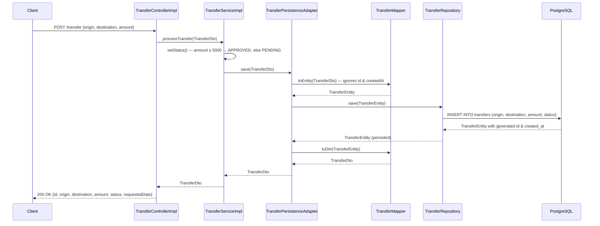
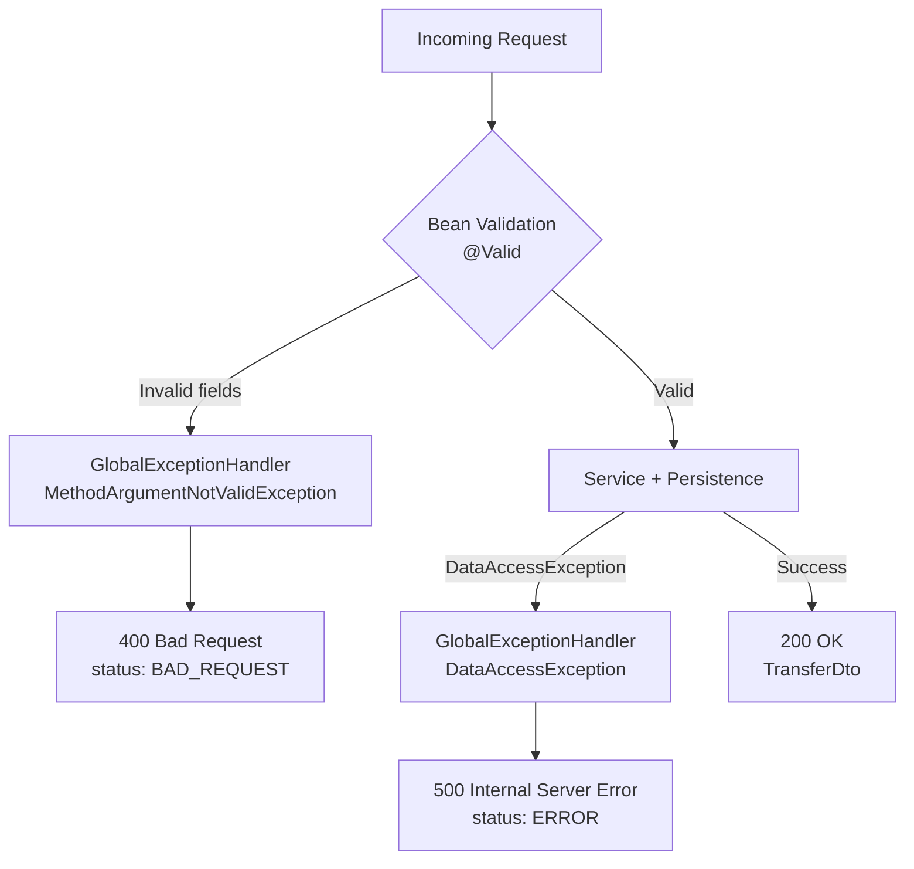
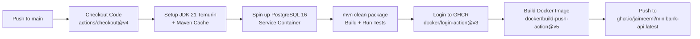

# MiniBank API

[](https://github.com/jaimeemi/minibank-api/actions/workflows/ci.yml)
[](https://openjdk.org/projects/jdk/21/)
[](https://spring.io/projects/spring-boot)
[](https://www.postgresql.org/)
[](https://docs.docker.com/compose/)
[](https://github.com/jaimeemi/minibank-api/pkgs/container/minibank-api)

---

## Overview

MiniBank is a production-ready RESTful banking API built with **Java 21** and **Spring Boot 3.4.1**. It solves the core problem of processing inter-account money transfers with automatic approval logic: transfers up to **$5,000** are instantly assigned `APPROVED`, while amounts exceeding that threshold are held as `PENDING` for further review.

Every transaction is persisted to **PostgreSQL 16** with a full audit timestamp (`created_at`). The project demonstrates a strict layered architecture, compile-time DTO mapping via MapStruct, schema-controlled DDL (`ddl-auto: none`), OpenAPI 3 interactive documentation, and a complete GitHub Actions CI/CD pipeline that builds, tests against a real PostgreSQL service container, and publishes a Docker image to **GitHub Container Registry (GHCR)** on every push to `main`.

---

## Tech Stack & Infrastructure

- **Java 21** — Virtual Threads enabled (`server.threads.virtual.enabled: true`) for high-throughput non-blocking I/O
- **Spring Boot 3.4.1** — Web, Data JPA, Validation, Actuator starters
- **Spring Data JPA + Hibernate** — ORM with `ddl-auto: none`; schema fully controlled by `src/main/resources/postgre/schema.sql`
- **PostgreSQL 16** — `BIGSERIAL` primary key, `CHECK (amount > 0)` constraint, two performance indexes (`idx_transfers_status`, `idx_transfers_origin`)
- **MapStruct 1.6.3** — Compile-time DTO ↔ Entity mapping via annotation processor; zero reflection overhead at runtime
- **Lombok** — Boilerplate reduction (`@Data`, `@Slf4j`, `@RequiredArgsConstructor`)
- **SpringDoc / Swagger UI 2.8.5** — Interactive OpenAPI 3 docs at `/swagger-ui.html` and `/api-docs`
- **Spring Kafka** — Dependency declared in `pom.xml`; autoconfiguration intentionally excluded (prepared for future event streaming)
- **Docker** — Multi-stage `Dockerfile` (`maven:3.9.6-eclipse-temurin-21-alpine` build stage → `eclipse-temurin:21-jre-alpine` runtime); unprivileged system user `minibank` at runtime
- **Docker Compose** — Orchestrates `postgres-db` (with `healthcheck`) and `minibank-api` with `depends_on: condition: service_healthy`
- **GitHub Actions** — CI/CD pipeline on push to `main`: build → test (real PostgreSQL 16 service) → push image to `ghcr.io/jaimeemi/minibank-api:latest`
- **JUnit 5 + Mockito** — Unit tests with no H2 or in-memory database
- **Maven 3.9.6** — Build and dependency management

---

## Architecture / System Flow

The application follows a strict **layered architecture** with unidirectional dependency flow. Each layer has a single responsibility and communicates only with the layer directly below it.

- `TransferControllerImpl` receives the HTTP request, delegates immediately to the service — no business logic here.
- `TransferServiceImpl` applies the approval rule (`amount ≤ 5000 → APPROVED`, else `PENDING`) and delegates persistence.
- `TransferPersistenceAdapter` acts as a facade: it converts the DTO to an entity via `TransferMapper`, calls `TransferRepository.save()`, and maps the persisted entity back to a DTO.
- `TransferMapper` is a compile-time MapStruct interface; `id` and `createdAt` are ignored on `toEntity` to let the database generate them.
- `GlobalExceptionHandler` intercepts `MethodArgumentNotValidException` (→ 400) and `DataAccessException` (→ 500) globally via `@RestControllerAdvice`.

```
HTTP Client
    │
    ▼
┌──────────────────────────────┐
│  TransferControllerImpl      │  POST /transfer — delegates to service
└──────────────┬───────────────┘
               │
               ▼
┌──────────────────────────────┐
│  TransferServiceImpl         │  setStatus(): amount ≤ 5000 → APPROVED, else PENDING
└──────────────┬───────────────┘
               │
               ▼
┌──────────────────────────────┐
│  TransferPersistenceAdapter  │  @Transactional — DTO → Entity → save → DTO
└──────────────┬───────────────┘
               │
               ▼
┌──────────────────────────────┐
│  TransferRepository (JPA)    │  JpaRepository<TransferEntity, Long>
└──────────────┬───────────────┘
               │
               ▼
          PostgreSQL 16
```



### Error Handling Flow



---

## Prerequisites & Installation

### Requirements

| Tool           | Version |
|----------------|---------|
| Docker         | 24+     |
| Docker Compose | 2.x     |
| Java           | 21      |
| Maven          | 3.9.6   |

---

### Option 1 — Docker Compose (recommended)

The API waits for PostgreSQL to pass its health check (`pg_isready`) before starting. The schema is initialized automatically from `src/main/resources/postgre/schema.sql` on every startup (`sql.init.mode: always`).

```bash
git clone https://github.com/jaimeemi/minibank-api.git
cd minibank-api
docker-compose up --build
```

| Service       | Container         | Port   |
|---------------|-------------------|--------|
| Spring Boot   | `minibank-app`    | `9000` |
| PostgreSQL 16 | `minibank-postgres`| `5432` |

---

### Option 2 — Run locally (without Docker)

Requires a running PostgreSQL instance at `localhost:5432` with a database named `minibank`.

```bash
git clone https://github.com/jaimeemi/minibank-api.git
cd minibank-api

export SPRING_DATASOURCE_URL=jdbc:postgresql://localhost:5432/minibank
export SPRING_DATASOURCE_USERNAME=emilio
export SPRING_DATASOURCE_PASSWORD=<your_password>

./mvnw spring-boot:run
```

---

### Build JAR

```bash
./mvnw clean package -DskipTests
```

### Run tests only

```bash
./mvnw test
```

> Tests require a live PostgreSQL instance. Set the environment variables above before running.

---

## Core Features & Endpoints

### Automatic Approval Logic

| Condition       | Assigned Status |
|-----------------|-----------------|
| `amount ≤ 5000` | `APPROVED`      |
| `amount > 5000` | `PENDING`       |
| *(future)*      | `REJECTED`      |

---

### REST Endpoints

| Method | Path        | Description                                   | Success | Error         |
|--------|-------------|-----------------------------------------------|---------|---------------|
| `POST` | `/transfer` | Process a new transfer and persist the result | `200`   | `400` / `500` |

#### `POST /transfer` — Request Body

```json
{
  "origin": "123456",
  "destination": "789012",
  "amount": 1500.00
}
```

#### `POST /transfer` — Response `200 OK`

```json
{
  "id": 1,
  "origin": "123456",
  "destination": "789012",
  "amount": 1500.00,
  "status": "APPROVED",
  "requestedDate": "2025-01-15 10:30:00"
}
```

#### Error Responses

| HTTP Code | Trigger                            | Response `status` field |
|-----------|------------------------------------|-------------------------|
| `400`     | Missing or invalid request fields  | `BAD_REQUEST`           |
| `500`     | Database persistence failure       | `ERROR`                 |

---

### Interactive API Documentation

| Resource     | URL                                    |
|--------------|----------------------------------------|
| Swagger UI   | http://localhost:9000/swagger-ui.html  |
| OpenAPI JSON | http://localhost:9000/api-docs         |

---

## Database Schema

Managed exclusively via `src/main/resources/postgre/schema.sql` (`ddl-auto: none`):

```sql
CREATE TABLE IF NOT EXISTS transfers (
    id          BIGSERIAL,
    origin      VARCHAR(50)    NOT NULL,
    destination VARCHAR(50)    NOT NULL,
    amount      NUMERIC(15, 2) NOT NULL,
    status      VARCHAR(20)    NOT NULL,
    created_at  TIMESTAMP WITHOUT TIME ZONE DEFAULT CURRENT_TIMESTAMP NOT NULL,

    CONSTRAINT pk_transfers PRIMARY KEY (id),
    CONSTRAINT chk_transfer_amount CHECK (amount > 0)
);

CREATE INDEX IF NOT EXISTS idx_transfers_status ON transfers(status);
CREATE INDEX IF NOT EXISTS idx_transfers_origin ON transfers(origin);
```

- `idx_transfers_status` — optimizes operational queries filtering by `PENDING` or `APPROVED`.
- `idx_transfers_origin` — accelerates reconciliation queries by source account.

---

## DevOps & CI/CD Pipeline

### Existing Pipeline — GitHub Actions (`.github/workflows/ci.yml`)

Triggers on every push to `main`. Single job: `build-and-test`.



| Step | Action | Detail |
|------|--------|--------|
| Checkout | `actions/checkout@v4` | Clones the repository |
| JDK Setup | `actions/setup-java@v4` | Temurin 21 + Maven dependency cache |
| PostgreSQL Service | `postgres:16-alpine` | Real DB container — no H2, no mocks |
| Build & Test | `mvn clean package` | Compiles, runs all unit tests |
| GHCR Login | `docker/login-action@v3` | Authenticates with `GITHUB_TOKEN` |
| Docker Push | `docker/build-push-action@v5` | Builds multi-stage image and pushes `latest` tag |

> The pipeline uses a **real PostgreSQL 16 service container** during tests, ensuring integration-level confidence without any in-memory database substitutes.

---

### Future DevOps Enhancements

#### 1. Kubernetes Deployment with Helm

Package the application as a Helm chart targeting a Kubernetes cluster. The existing Docker Compose `healthcheck` on port `9000` maps directly to Kubernetes probes:

```yaml
readinessProbe:
  httpGet:
    path: /actuator/health/readiness
    port: 9000
  initialDelaySeconds: 10
livenessProbe:
  httpGet:
    path: /actuator/health/liveness
    port: 9000
  initialDelaySeconds: 20
```

Add a `HorizontalPodAutoscaler` targeting CPU/memory thresholds and a `PodDisruptionBudget` (`minAvailable: 1`) for zero-downtime rolling updates. Extend the CI pipeline with a `helm upgrade --install` step after the Docker push.

#### 2. Observability Stack — Prometheus + Grafana + OpenTelemetry

Spring Boot Actuator is already on the classpath. The next step is to expose a `/actuator/prometheus` metrics endpoint by adding the Micrometer Prometheus registry dependency, then scrape it with a **Prometheus** instance and visualize transfer throughput, error rates, and JVM Virtual Thread pool metrics on **Grafana** dashboards. Add **OpenTelemetry** instrumentation to trace each transfer request end-to-end across `TransferControllerImpl` → `TransferServiceImpl` → `TransferPersistenceAdapter`, exportable to Tempo or Jaeger.

#### 3. Kafka Event Streaming for Transfer Events

The `spring-kafka` dependency is already declared in `pom.xml` and autoconfiguration is intentionally excluded. The next step is to publish a `TransferProcessedEvent` to a Kafka topic inside `TransferServiceImpl` after a successful `adapter.save()`, enabling downstream consumers (notification service, audit log, fraud detection) to react asynchronously without coupling to the core API.

---

## Project Structure

```
minibank-api/
├── .github/workflows/ci.yml              # GitHub Actions CI/CD pipeline
├── Dockerfile                            # Multi-stage build (Maven → JRE Alpine)
├── docker-compose.yml                    # PostgreSQL 16 + Spring Boot orchestration
├── pom.xml                               # Maven dependencies & build config
└── src/main/
    ├── java/com/minibank/
    │   ├── ApiApplication.java           # Spring Boot entry point
    │   ├── controller/
    │   │   ├── TransferController.java   # REST interface + OpenAPI annotations
    │   │   └── impl/TransferControllerImpl.java
    │   ├── service/
    │   │   ├── TransferService.java
    │   │   └── impl/TransferServiceImpl.java  # Approval rule logic
    │   ├── component/
    │   │   └── TransferPersistenceAdapter.java # @Transactional persistence facade
    │   ├── mapper/
    │   │   └── TransferMapper.java       # MapStruct compile-time mapper
    │   ├── models/
    │   │   ├── dto/TransferDto.java
    │   │   ├── entities/TransferEntity.java
    │   │   └── enums/StatusEnum.java     # APPROVED | PENDING | REJECTED
    │   ├── repositories/
    │   │   └── TransferRepository.java   # JpaRepository<TransferEntity, Long>
    │   └── error/
    │       └── GlobalExceptionHandler.java # @RestControllerAdvice — 400 / 500
    └── resources/
        ├── application.yml
        └── postgre/schema.sql            # DDL — single source of truth
```
