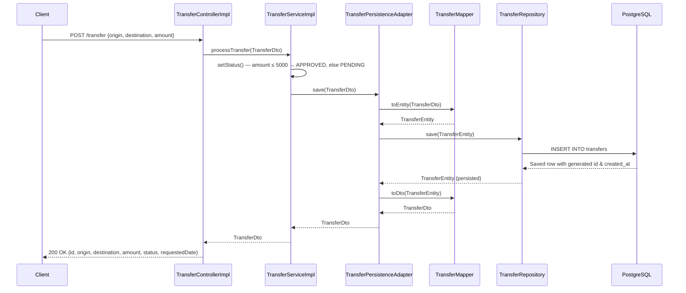
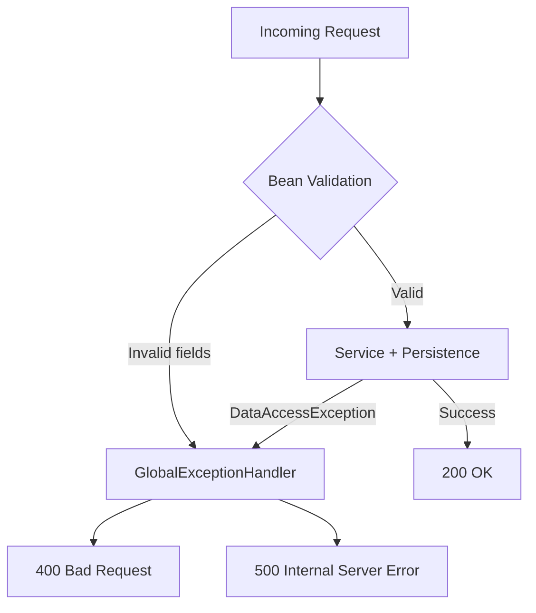
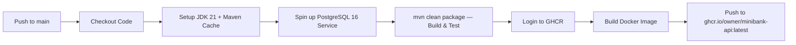

# MiniBank API

[](https://github.com/your-username/minibank/actions/workflows/ci.yml)


## Overview

MiniBank is a production-ready RESTful banking API built with **Spring Boot 3** and **Java 21**. It processes inter-account money transfers with automatic approval logic based on transfer amount, persists all transactions to **PostgreSQL**, and is fully containerized with Docker.

The project demonstrates a clean layered architecture, MapStruct-based DTO mapping, schema-controlled DDL, OpenAPI documentation, and a GitHub Actions CI/CD pipeline that builds, tests, and publishes a Docker image to GitHub Container Registry (GHCR) on every push to `main`.

---

## Tech Stack

- **Java 21** — Virtual Threads enabled for high-throughput non-blocking I/O
- **Spring Boot 3.4.1** — Web, Data JPA, Validation, Actuator
- **Spring Data JPA + Hibernate** — ORM layer with manual DDL control (`ddl-auto: none`)
- **PostgreSQL 16** — Relational persistence with custom indexes
- **MapStruct 1.6.3** — Compile-time DTO ↔ Entity mapping
- **Lombok** — Boilerplate reduction (`@Data`, `@Slf4j`, `@RequiredArgsConstructor`)
- **SpringDoc / Swagger UI 2.8.5** — Interactive OpenAPI 3 documentation
- **Spring Kafka** — Dependency included; autoconfiguration excluded (prepared for future event streaming)
- **Docker + Docker Compose** — Multi-stage image build, unprivileged runtime user
- **GitHub Actions** — CI pipeline: build → test → push image to GHCR
- **JUnit 5 + Mockito** — Unit testing with no external dependencies (no H2)
- **Maven 3.9.6** — Build and dependency management

---

## Architecture / System Flow

The application follows a strict **layered architecture** with unidirectional dependency flow. Each layer has a single responsibility and communicates only with the layer directly below it.

```
HTTP Client
    │
    ▼
┌─────────────────────────────┐
│  TransferController (REST)  │  ← Interface + Impl separation
└─────────────┬───────────────┘
              │ delegates to
              ▼
┌─────────────────────────────┐
│   TransferService (Logic)   │  ← Applies approval rule (amount ≤ 5000)
└─────────────┬───────────────┘
              │ delegates to
              ▼
┌──────────────────────────────────┐
│  TransferPersistenceAdapter      │  ← Converts DTO → Entity via MapStruct
└─────────────┬────────────────────┘
              │ calls
              ▼
┌─────────────────────────────┐
│   TransferRepository (JPA)  │  ← Spring Data interface
└─────────────┬───────────────┘
              │
              ▼
         PostgreSQL
```

### Mermaid Diagram



### Error Handling Flow



---

## Prerequisites & Installation

### Requirements

| Tool           | Version  |
|----------------|----------|
| Docker         | 24+      |
| Docker Compose | 2.x      |
| Java (optional)| 21       |
| Maven (optional)| 3.9.6   |

### Run with Docker Compose (recommended)

```bash
# Clone the repository
git clone https://github.com/your-username/minibank.git
cd minibank

# Build and start both PostgreSQL and the API
docker-compose up --build
```

The API waits for PostgreSQL to pass its health check before starting. The database schema is initialized automatically from `src/main/resources/postgre/schema.sql`.

### Run locally (without Docker)

Requires a running PostgreSQL instance at `localhost:5432` with a database named `minibank`.

```bash
# Set environment variables (or use the defaults in application.yml)
export SPRING_DATASOURCE_URL=jdbc:postgresql://localhost:5432/minibank
export SPRING_DATASOURCE_USERNAME=<your_user>
export SPRING_DATASOURCE_PASSWORD=<your_password>

./mvnw spring-boot:run
```

### Build the JAR

```bash
./mvnw clean package -DskipTests
```

### Run tests only

```bash
# Runs all unit tests (no DB required — no H2, pure Mockito)
./mvnw test -Dgroups='!integration'
```

---

## Core Features & Endpoints

### Automatic Approval Logic

The core business rule applied on every transfer:

| Condition        | Assigned Status |
|------------------|-----------------|
| `amount ≤ 5000`  | `APPROVED`      |
| `amount > 5000`  | `PENDING`       |
| *(future)*       | `REJECTED`      |

### REST Endpoints

#### `POST /transfer`

Processes a new bank transfer and returns the persisted result.

**Request Body**
```json
{
  "origin": "123456",
  "destination": "789012",
  "amount": 1500.00
}
```

**Response `200 OK`**
```json
{
  "id": 1,
  "origin": "123456",
  "destination": "789012",
  "amount": 1500.00,
  "status": "APPROVED",
  "requestedDate": "2025-01-15 10:30:00"
}
```

**Error Responses**

| Code  | Trigger                              | Body field `status` |
|-------|--------------------------------------|---------------------|
| `400` | Missing or invalid request fields    | `BAD_REQUEST`       |
| `500` | Database persistence failure         | `ERROR`             |

### Interactive API Documentation

| Resource     | URL                                   |
|--------------|---------------------------------------|
| Swagger UI   | http://localhost:9000/swagger-ui.html |
| OpenAPI JSON | http://localhost:9000/api-docs        |

---

## CI/CD Pipeline

The GitHub Actions workflow (`.github/workflows/ci.yml`) triggers on every push to `main` and executes the following stages:



- Uses a **real PostgreSQL 16** service container during tests (no mocks, no H2).
- Maven dependency cache reduces build time on subsequent runs.
- Docker image is published to **GitHub Container Registry** using `GITHUB_TOKEN` (no secrets required).

---

## Database Schema

```sql
CREATE TABLE IF NOT EXISTS transfers (
    id          BIGSERIAL PRIMARY KEY,
    origin      VARCHAR(50)      NOT NULL,
    destination VARCHAR(50)      NOT NULL,
    amount      NUMERIC(15, 2)   NOT NULL CHECK (amount > 0),
    status      VARCHAR(20)      NOT NULL,
    created_at  TIMESTAMP        DEFAULT CURRENT_TIMESTAMP NOT NULL
);

CREATE INDEX IF NOT EXISTS idx_transfers_status ON transfers(status);
CREATE INDEX IF NOT EXISTS idx_transfers_origin ON transfers(origin);
```

- `idx_transfers_status` — optimizes queries filtering by `PENDING` or `APPROVED` status.
- `idx_transfers_origin` — accelerates reconciliation queries by source account.

---

## Project Structure

```
com.minibank
├── controller/
│   ├── TransferController.java          # REST interface with OpenAPI annotations
│   └── impl/TransferControllerImpl.java # HTTP delegation to service
├── service/
│   ├── TransferService.java             # Business logic interface
│   └── impl/TransferServiceImpl.java    # Approval rule + orchestration
├── component/
│   └── TransferPersistenceAdapter.java  # Persistence facade (DTO ↔ Entity + save)
├── mapper/
│   └── TransferMapper.java              # MapStruct interface (compile-time generated)
├── models/
│   ├── dto/TransferDto.java
│   ├── entitys/TransferEntity.java
│   └── enums/StatusEnum.java            # APPROVED | PENDING | REJECTED
├── repositories/
│   └── TransferRepository.java          # Spring Data JPA
├── error/
│   └── GlobalExceptionHandler.java      # @RestControllerAdvice — 400 / 500
└── ApiApplication.java
```

---

## DevOps & Future Enhancements

### 1. Kubernetes Deployment with Helm
Package the application as a Helm chart to deploy on Kubernetes. Add a `HorizontalPodAutoscaler` targeting CPU/memory thresholds and a `PodDisruptionBudget` for zero-downtime rolling updates. The existing health check logic in Docker Compose maps directly to Kubernetes `readinessProbe` and `livenessProbe` definitions.

### 2. Observability Stack (Metrics + Tracing)
Integrate **Spring Boot Actuator** with **Micrometer** exporting metrics to **Prometheus**, visualized via **Grafana** dashboards. Add **OpenTelemetry** instrumentation for distributed tracing (e.g., with Tempo or Jaeger) to trace each transfer request end-to-end across service and persistence layers.

### 3. Kafka Event Streaming for Transfer Events
The Spring Kafka dependency is already included and autoconfiguration is intentionally excluded. The next step is to publish a `TransferProcessedEvent` to a Kafka topic after each successful persistence, enabling downstream consumers (e.g., a notification service or audit log) to react asynchronously without coupling to the core API.
